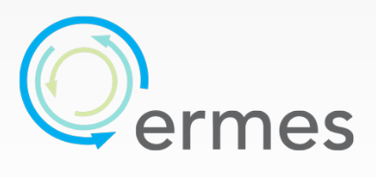
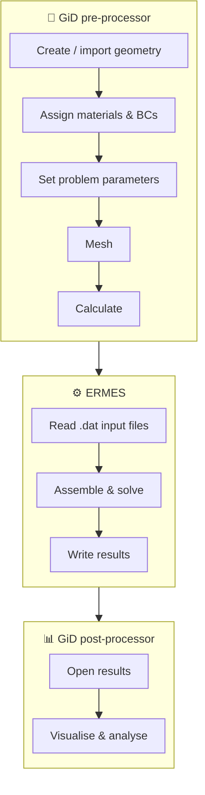
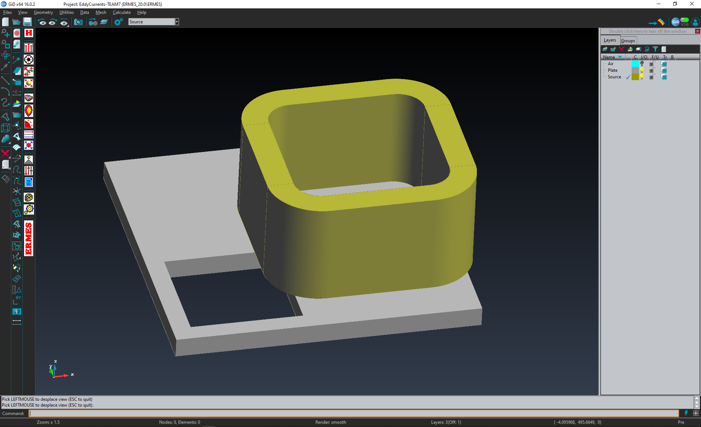
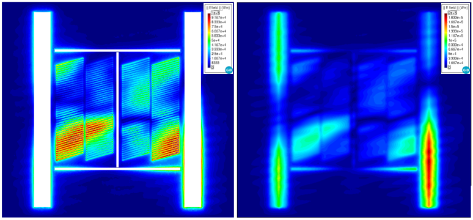
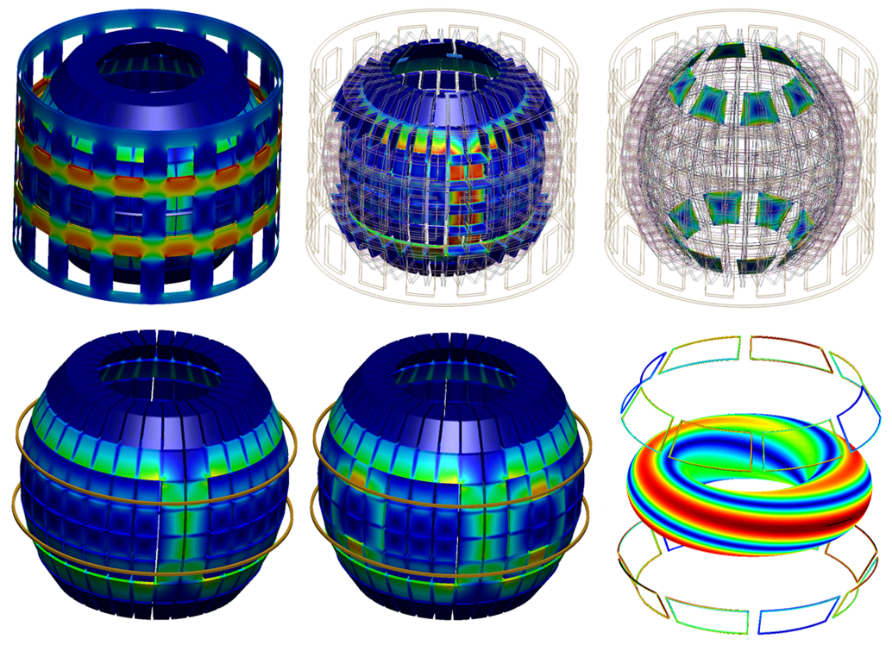
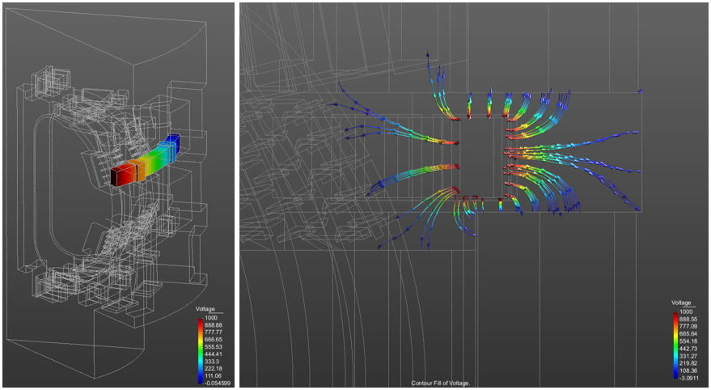

<div align="center">



# ERMES 20.0.4

**E**lectric **R**egularized **M**axwell's **E**quations with **S**ingularities

*Open-source finite element tool for computational electromagnetics in the frequency domain*

[](#license)


[Overview](#overview) •
[Features](#features) •
[Package contents](#package-contents) •
[Installation](#installation) •
[PETSc](#petsc) •
[Workflow](#workflow) •
[Gallery](#gallery) •
[Citation](#citation) •
[Contact](#contact)

</div>

---

<a id="overview"></a>

## 🔭 Overview

ERMES is an open-source C++ finite element (FEM) code that solves Maxwell's equations in the frequency domain. Version 20.0.4 is a major upgrade, adding new modules, FEM formulations and HPC capabilities aimed at the demanding electromagnetic problems found in the design and analysis of nuclear fusion reactors.

ERMES works across the **static, quasi-static and high-frequency** regimes. It has been applied to microwave engineering, bioelectromagnetics, electromagnetic compatibility and electromagnetic forming, and, through its electrostatic and cold-plasma modules, to fusion problems such as plasma disruption induced currents and forces, plasma control, electric-arc initiation, and wave–plasma–wall interaction.

The graphical user interface is fully integrated into the pre/post-processor **[GiD](https://www.gidsimulation.com)**, which handles geometry, data input, meshing, and visualisation. GiD is the recommended option for setting up simulations and post-processing results, but it is not required. Any pre-processor can be used, provided that it generates the ERMES input files in the format described in the manual.

---

<a id="features"></a>

## ✨ Features

### 🧮 FEM formulations

| Formulation | Elements | A–φ potentials | Lagrange-multiplier stabilisation |
|---|---|:---:|:---:|
| Regularized Maxwell's equations | Nodal | ✅ | — |
| Double-curl Maxwell's equations | Edge | ✅ | ✅ (switchable) |
| Local L² projection method | Nodal + bubble | ✅ | ✅ (switchable) |

Having several formulations lets you pick the most stable one for each problem and produce the best-conditioned matrix, which can often be solved with low-memory iterative methods. The regularized nodal formulation includes dedicated treatment of field **discontinuities** and **singularities**.

### 🧱 Materials
- **IHL materials** — isotropic, homogeneous, linear media
- **Cold plasma** — configurable plasma geometry, composition and problem settings

### ⚡ Sources
- **Volumetric current densities J** — Cartesian, axisymmetric, combined Cartesian + axisymmetric, helicoidal, and plasma modes
- **Boundary sources** — rectangular waveguide ports (TE10), coaxial ports (TEM), plane waves, Gaussian beams, quasi-static and electrostatic current fluxes

### 🧭 Boundary conditions
- **Dirichlet** — PEC, PMC, TEC, periodic/cyclic (PBC), full-wave voltage, electrostatic voltage, singularity
- **Robin** — full-wave and cold-plasma far-field conditions (FW, RW, LW, PW waves), plane-wave / Gaussian-beam / quasi-static Robin coefficients, imported Robin data, electrostatic Robin, coaxial TEM and RW-port TE10

### 📊 Outputs
- Frequency-domain, time-domain, cold-plasma and electrostatic field visualisation
- Surface and volume integrals, scattering parameters, and fields-on-nodes files
- Results in GiD format, plus generic formats adaptable to other post-processors

### 🚀 Solvers & HPC
- Built-in **BiCG** and **TFQMR** iterative solvers with diagonal preconditioning and **OpenMP**
- **PETSc interface** that reads the ERMES system directly and in parallel, and solves it using direct or iterative solvers over **MPI** on workstations or SLURM clusters, with no Python or intermediate files.
- Interface to **Python NumPy**, with scripts to export the linear system in other formats
- Editable `.dat` input files and batch/Python scripts for parametric and cluster runs

---

<a id="package-contents"></a>

## 📦 Package contents

```
ERMES 20.0.4/
├── ERMES_20.0.4_Manual.pdf   📘 User manual
├── ERMES_CPP_20.0.4/         🧩 C++ source code
├── ERMES_20.0.4/             🖥️ GiD user interface (problemtype)
├── Examples/                 🧪 GiD usage examples
└── Utilities/                🛠️ Python tools, solvers and batch scripts
```

Download only what you need:

| Folder | Get it if you want to… |
|---|---|
| `ERMES_CPP_20.0.4` | work with or modify the C++ source code |
| `ERMES_20.0.4` | use ERMES through the GiD graphical interface |
| `Examples` | explore ready-made usage examples |
| `Utilities` | customise boundary conditions, plasmas, sources and solvers |

<details>
<summary><b>🧩 Inside the C++ source tree</b></summary>

| Subfolder | Contents |
|---|---|
| `ERMES/` | FEM formulations, boundary conditions, source elements, Gaussian integration tables, file I/O |
| `external_libraries/` | boost, gidpost, dirent, `cbp2make` (Linux makefiles from the VS solution) and `flex++bison++` |
| `includes/` | Object template definitions and header files |
| `license/` | Open-source license details |
| `linear_solvers/` | Internal iterative linear solvers |
| `sources/` | Core objects: `modeler.cpp` (solving strategies, system matrix, discontinuities/singularities, normals), `kernel.cpp`, the input parser/scanner and `gid_output.cpp` |
| `unix/` | Linux build scripts |
| `windows/` | Windows build scripts and `ERMES.sln` |

</details>

---

<a id="installation"></a>

## 🛠️ Installation

### 1. Install GiD
Download the latest GiD from [gidsimulation.com](https://www.gidsimulation.com), then register it via **Help → Register GiD** (local, USB, floating or named-user licence; a one-month free licence is available and renewable).

### 2. Install ERMES
Copy the entire `ERMES_20.0.4` folder into GiD's `problemtypes` directory (e.g. C:\MySoftware\GiD 16.0.2\problemtypes). Then, restart GiD and select **Data → Problem type → ERMES_20.0.4 → ERMES**. The ERMES logo and menu bar should appear. The same procedure applies to Windows and Linux.

### 3. Install PETSc
For high-performance computing and large problems, use the ERMES–PETSc interface in `Utilities/PETSc_Direct`. See installation details in **[ERMES–PETSc interface](#petsc)** below.

---

<a id="petsc"></a>

## ⚡ ERMES–PETSc interface

`ERMESPETScSolver` reads the ERMES linear system **A X₀ = B** directly and in parallel, solves it with **[PETSc](https://petsc.org)**, and writes the solution `Vector_Xo.bin` back for ERMES. **No Python and no intermediate files** are needed.

📁 Source: [`Utilities/PETSc_Direct`](https://github.com/Ruben-Otin/ERMES-20.0.4/tree/main/Utilities/PETSc_Direct)

| File | Purpose |
|---|---|
| `ERMESPETScSolver.cpp` | Solver source code |
| `makefile` | Builds the solver |
| `ERMES2PETSc.sh` | Script called by ERMES (all settings at the top) |

### 📥 Files read from the problem folder

| File | Content |
|---|---|
| `Matrix_A_cmplx.bin`, `Matrix_A_int.bin` | System matrix (coefficients, indices) |
| `Matrix_A_aux_cmplx.bin`, `Matrix_A_aux_int.bin` | Auxiliary matrix (Hermitic formats) |
| `Vector_B.bin` | Right-hand side |

### 🔍 Matrix formats (detected automatically)

| Format | `Matrix_A` | `Matrix_A_aux` |
|---|---|---|
| **Symmetric** | Diagonal + upper triangle of a complex symmetric matrix | — |
| **Full-matrix** | Entire matrix | — |
| **Hermitic-Symmetric** | Diagonal + upper triangle of the Hermitian volumetric contribution | Diagonal + upper triangle of the complex symmetric Robin boundary contribution |
| **Hermitic-Full** | As above | Entire Robin contribution, added as stored |

If `Matrix_A_aux` files are present the format is Hermitic, and the number of stored triangles selects the variant. The detected format is printed in the `*.info` file.

### 🛠️ Installation

```bash
# 1. Download PETSc
git clone -b release https://gitlab.com/petsc/petsc.git petsc

# 2. Environment (also needed before compiling the solver;
#    use the same PETSC_DIR and PETSC_ARCH in section 1 of ERMES2PETSc.sh)
export PETSC_DIR=$HOME/petsc
export PETSC_ARCH=arch-complex-M1
export LD_LIBRARY_PATH=$PETSC_DIR/$PETSC_ARCH/lib:$LD_LIBRARY_PATH

# 3. Configure PETSc (several configurations can coexist, one per PETSC_ARCH)
cd $PETSC_DIR
./configure PETSC_ARCH=arch-complex-M1 \
  --with-cc=gcc --with-cxx=g++ --with-fc=gfortran \
  --with-debugging=0 --with-scalar-type=complex --with-64-bit-indices=1 \
  --download-mpich --download-hwloc --download-openblas \
  --download-scalapack --download-mumps \
  --download-metis --download-parmetis --download-ptscotch \
  --download-cmake --download-bison --download-make
#    ...then run the "make" commands printed at the end of configure

# 4. Compile the solver (inside Utilities/PETSc_Direct)
make ERMESPETScSolver

# 5. Execution permissions
chmod +x *.sh ERMESPETScSolver
```

### ▶️ Use from ERMES

In ERMES, set **Solver type** to **External solver** and enter in **External solvers settings**:

| OS | Command |
|---|---|
| 🐧 Linux | `bash /path_to/PETSc_Direct/ERMES2PETSc.sh` |
| 🪟 Windows | `wsl bash /path_to/PETSc_Direct/ERMES2PETSc.sh` |

ERMES runs the script from the problem folder. Inside a **SLURM** job, the solver runs on all the nodes and tasks of the job. All solver output, including errors, goes to the ERMES `*.info` file.

The script can also be run without ERMES, from a folder that contains the matrix and vector files:

```bash
cd /path_to/problem_folder
bash /path_to/PETSc_Direct/ERMES2PETSc.sh
```

For more information, see README.txt in `Utilities/PETSc_Direct` or visit [petsc.org](https://petsc.org).

---

<a id="workflow"></a>

## 🔁 Workflow




GiD is recommended but not required. Any pre-processor can be used as long as it writes the `.dat` input files in the format defined by the `.bas` templates in `ERMES_20.0.4/ERMES.gid`. Those `.dat` files can also be edited directly for parametric batch runs.

---

<a id="gallery"></a>

## 🖼️ Gallery

<p align="center">
  <br/>
  <sub>ERMES GiD interface with CAD geometry of a coil and an asymmetrical conductive plate with a hole from the TEAM
benchmark problem 7</sub>
</p>

<p align="center">
  <br/>
  <sub>Electric field generated by the JET A2 antenna</sub>
</p>

<p align="center">
  <br/>
  <sub>Cut planes of the electric field generated by the JET A2 antenna</sub>
</p>

<p align="center">
  <br/>
  <sub>Eddy currents induced on ITER walls by plasma disruption</sub>
</p>

<p align="center">
  <br/>
  <sub>Eddy currents induced on STEP components by plasma and control coils</sub>
</p>

<p align="center">
  <br/>
  <sub>Electric currents following an electric arc strike on ITER components</sub>
</p>

<p align="center">
  <br/>
  <sub>Voltage induced by a quench in a superconducting poloidal coil of ITER</sub>
</p>


<p align="center">
  <br/>
  <sub>Fields leaking from a curved coaxial cable braided shield</sub>
</p>

---

<a id="documentation"></a>

## 📘 Documentation

The full user manual, `ERMES_20.0.4_Manual.pdf`, covers:

1. **Introduction** — user interface, C++ source code, license
2. **Installation** — GiD, ERMES, PETSc
3. **Pre-process** — geometry, materials, sources, boundary conditions, and problem settings
4. **Post-process** — output files and GiD visualisation
5. **Appendix A** — electromagnetic theory
6. **Appendix B** — finite element formulations

---

<a id="citation"></a>

## 📝 Citation

Publications resulting from the use of ERMES **must cite**:

R. Otin, "ERMES 20.0: Open-source finite element tool for computational electromagnetics in the frequency domain", *Computer Physics Communications*, Vol. 310, 109521, 2025.

```bibtex
@article{Otin2025ERMES,
  author  = {R. Otin},
  title   = {{ERMES} 20.0: Open-source finite element tool for computational
             electromagnetics in the frequency domain},
  journal = {Computer Physics Communications},
  volume  = {310},
  pages   = {109521},
  year    = {2025}
}
```

---

<a id="license"></a>

## ⚖️ License

ERMES 20.0.4 source code, binaries and interface are released under the **2-clause BSD license**.

<details>
<summary>Full license text</summary>

```
Copyright (c) 2013 Ruben Otin, CIMNE (International Center for Numerical
Methods in Engineering). All rights reserved.

Redistribution and use in source and binary forms, with or without
modification, are permitted provided that the following conditions are met:

1. Redistributions of source code must retain the above copyright notice,
   this list of conditions and the following disclaimer.

2. Redistributions in binary form must reproduce the above copyright notice,
   this list of conditions and the following disclaimer in the documentation
   and/or other materials provided with the distribution.

THIS SOFTWARE IS PROVIDED BY THE COPYRIGHT HOLDERS AND CONTRIBUTORS "AS IS"
AND ANY EXPRESS OR IMPLIED WARRANTIES, INCLUDING, BUT NOT LIMITED TO, THE
IMPLIED WARRANTIES OF MERCHANTABILITY AND FITNESS FOR A PARTICULAR PURPOSE
ARE DISCLAIMED. IN NO EVENT SHALL THE COPYRIGHT HOLDER OR CONTRIBUTORS BE
LIABLE FOR ANY DIRECT, INDIRECT, INCIDENTAL, SPECIAL, EXEMPLARY, OR
CONSEQUENTIAL DAMAGES (INCLUDING, BUT NOT LIMITED TO, PROCUREMENT OF
SUBSTITUTE GOODS OR SERVICES; LOSS OF USE, DATA, OR PROFITS; OR BUSINESS
INTERRUPTION) HOWEVER CAUSED AND ON ANY THEORY OF LIABILITY, WHETHER IN
CONTRACT, STRICT LIABILITY, OR TORT (INCLUDING NEGLIGENCE OR OTHERWISE)
ARISING IN ANY WAY OUT OF THE USE OF THIS SOFTWARE, EVEN IF ADVISED OF THE
POSSIBILITY OF SUCH DAMAGE.
```

</details>

---

<a id="contact"></a>

## 📬 Contact

**Ruben Otin** — United Kingdom Atomic Energy Authority (UKAEA), Oxford, UK

- ✉️ [ruben.otin@ukaea.uk](mailto:ruben.otin@ukaea.uk)
- ✉️ [ruben.otin.bcn@gmail.com](mailto:ruben.otin.bcn@gmail.com)
- 🌐 [ruben-otin.blogspot.com](https://ruben-otin.blogspot.com)

<div align="center">
<sub>ERMES 20.0.4 · October 2026</sub>
</div>
