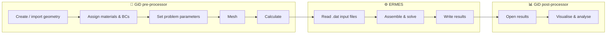
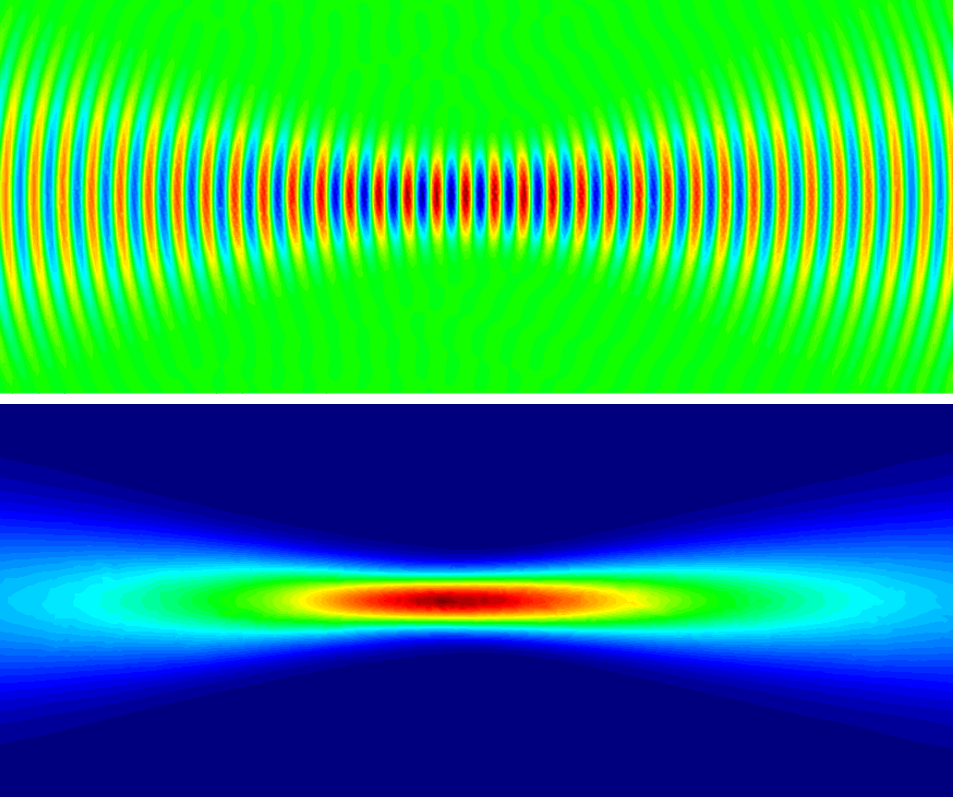
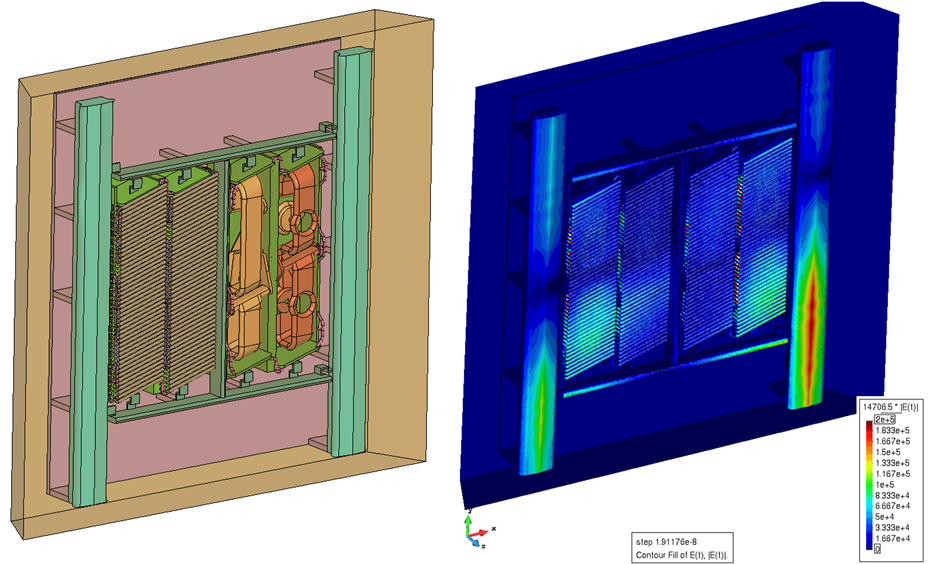
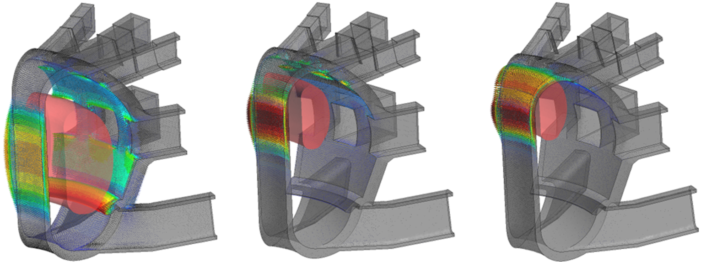
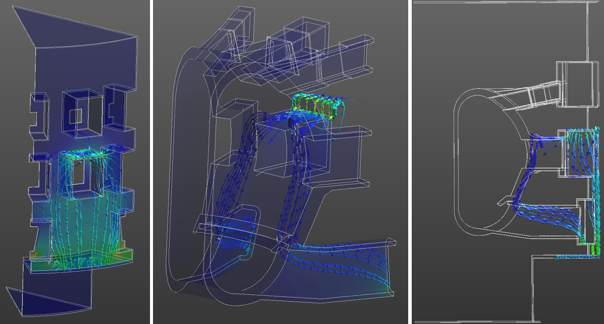
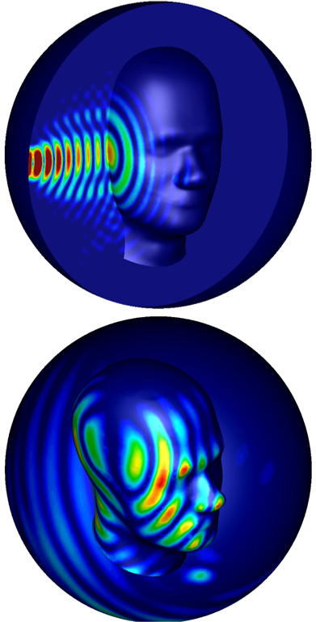
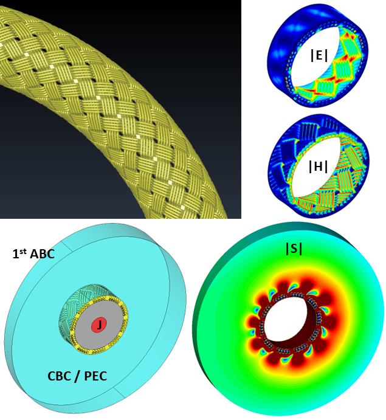

<div align="center">


# ERMES 20.0.4

**E**lectric **R**egularized **M**axwell's **E**quations with **S**ingularities

*Open-source finite element tool for computational electromagnetics in the frequency domain*

[](#-license)


[Overview](#-overview) •
[Features](#-features) •
[Package contents](#-package-contents) •
[Installation](#-installation) •
[PETSc](#-ermespetsc-direct-interface) •
[Workflow](#-workflow) •
[Gallery](#-gallery) •
[Citation](#-citation) •
[Contact](#-contact)

</div>

---

## 🔭 Overview

ERMES is an open-source C++ finite element (FEM) code that solves Maxwell's equations in the frequency domain. Version 20.0 is a major upgrade of ERMES 7.0, adding new modules, FEM formulations and HPC capabilities aimed at the demanding electromagnetic problems found in the design and analysis of **nuclear fusion reactors**.

ERMES works across the **static, quasi-static and high-frequency** regimes. It has been applied to microwave engineering, bioelectromagnetics, electromagnetic compatibility and electromagnetic forming, and, through its electrostatic and cold-plasma modules, to fusion problems such as induced forces, plasma control, electric-arc initiation, current distribution in arbitrary geometries and wave–plasma–wall interaction.

The graphical user interface is fully integrated into the pre/post-processor **[GiD](https://www.gidsimulation.com)**, which handles geometry, data input, meshing and visualisation.

---

## ✨ Features

### 🧮 FEM formulations

| Formulation | Elements | A–φ potentials | Lagrange-multiplier stabilisation |
|---|---|:---:|:---:|
| Regularized Maxwell's equations | Nodal | ✅ | — |
| Double-curl Maxwell's equations | Edge | ✅ | ✅ (switchable) |
| Local L² projection method | Nodal + bubble | ✅ | ✅ (switchable) |

Having several formulations lets you pick the most stable one for each problem and produce the best-conditioned matrix, which can often be solved with low-memory iterative methods. The regularized nodal formulation includes dedicated treatment of field **discontinuities** and **singularities**.

### 🧱 Materials
- **IHL materials** — isotropic, homogeneous, linear media
- **Cold plasma** — configurable plasma geometry, composition and problem settings

### ⚡ Sources
- **Volumetric current densities J** — Cartesian, axisymmetric, combined Cartesian + axisymmetric, helicoidal, and plasma modes
- **Boundary sources** — rectangular waveguide ports (TE10), coaxial ports (TEM), plane waves, Gaussian beams, quasi-static and electrostatic current fluxes

### 🧭 Boundary conditions
- **Dirichlet** — PEC, PMC, TEC, periodic/cyclic (PBC), full-wave voltage, electrostatic voltage, singularity
- **Robin** — full-wave and cold-plasma far-field conditions (FW, RW, LW, PW waves), plane-wave / Gaussian-beam / quasi-static Robin coefficients, imported Robin data, electrostatic Robin, coaxial TEM and RW-port TE10

### 📊 Outputs
- Frequency-domain, time-domain, cold-plasma and electrostatic field visualisation
- Surface and volume integrals, **scattering parameters**, and fields-on-nodes files
- Results in GiD format, plus formats adaptable to other post-processors

### 🚀 Solvers & HPC
- Built-in **BiCG** and **TFQMR** iterative solvers with diagonal preconditioning and **OpenMP**
- **[ERMES–PETSc direct interface](#-ermespetsc-direct-interface)** — reads the ERMES system directly and in parallel and solves it with MUMPS LU/Cholesky or LGMRES over **MPI**, on workstations or SLURM clusters; no Python or intermediate files
- Interface to **Python NumPy**, with scripts to export the linear system in other formats
- Editable `.dat` input files and batch/Python scripts for parametric and cluster runs

---

## 📦 Package contents

```
ERMES 20.0.4/
├── ERMES_20.0.4_Manual.pdf   📘 User manual
├── ERMES_CPP_20.0.4/         🧩 C++ source code
├── ERMES_20.0.4/             🖥️ GiD user interface (problemtype)
├── Examples/                 🧪 GiD usage examples
└── Utilities/                🛠️ Python tools, solvers and batch scripts
    └── PETSc_Direct/         ⚡ ERMES–PETSc direct solver
```

Download only what you need:

| Folder | Get it if you want to… |
|---|---|
| `ERMES_CPP_20.0.4` | work with or modify the C++ source code |
| `ERMES_20.0.4` | use ERMES through the GiD graphical interface |
| `Examples` | explore ready-made usage examples |
| `Utilities` | customise boundary conditions, plasmas, sources and solvers |

<details>
<summary><b>🧩 Inside the C++ source tree</b></summary>

| Subfolder | Contents |
|---|---|
| `ERMES/` | FEM formulations, boundary conditions, source elements, Gaussian integration tables, file I/O |
| `external_libraries/` | boost, gidpost, dirent, `cbp2make` (Linux makefiles from the VS solution) and `flex++bison++` |
| `includes/` | Object template definitions and header files |
| `license/` | Open-source license details |
| `linear_solvers/` | Internal iterative linear solvers |
| `sources/` | Core objects: `modeler.cpp` (solving strategies, system matrix, discontinuities/singularities, normals), `kernel.cpp`, the input parser/scanner and `gid_output.cpp` |
| `unix/` | Linux build scripts |
| `windows/` | Windows build scripts and `ERMES.sln` |

</details>

---

## 🛠️ Installation

### 1. Install GiD
Download the latest GiD from [gidsimulation.com](https://www.gidsimulation.com), then register it via **Help → Register GiD** (local, USB, floating or named-user licence; a one-month free licence is available and renewable).

### 2. Install the ERMES problemtype
Copy the entire `ERMES_20.0.4` folder into GiD's `problemtypes` directory — the same on Windows and Linux:

```
C:\MySoftware\GiD 16.0.2\problemtypes\ERMES_20.0.4
```

Restart GiD and select **Data → Problem type → ERMES_20.0 → ERMES**. The ERMES logo and menu bar should appear.

> [!TIP]
> Older ERMES 20.0 models can be upgraded with **Transform to new problem type**. Use **Reset to new problem type** only when the differences between versions are significant.

### 3. (Optional) Compile from source

<details>
<summary><b>🐧 Linux</b></summary>

```bash
cd ERMES_CPP_20.0.4/unix
make
```
See `unix/README.txt` for details and makefile generation.

</details>

<details>
<summary><b>🪟 Windows</b></summary>

Open `ERMES_CPP_20.0.4/windows/ERMES.sln` in **Microsoft Visual Studio 2022** and build. See `windows/README.txt` for details.

</details>

> [!IMPORTANT]
> After recompiling, make sure `ERMES.unix.bat` / `ERMES.win.bat` in `ERMES_20.0.4/ERMES.gid` call the executable you intend to use. On Linux, grant execute permission to the script and every executable it references.

### 4. (Optional) Install the ERMES–PETSc direct solver
For large problems, use the PETSc interface in `Utilities/PETSc_Direct` — see **[ERMES–PETSc direct interface](#-ermespetsc-direct-interface)** below.

---

## ⚡ ERMES–PETSc direct interface

`ERMESPETScSolver` reads the ERMES linear system **A X₀ = B** directly and in parallel, solves it with **[PETSc](https://petsc.org)**, and writes the solution `Vector_Xo.bin` back for ERMES. **No Python and no intermediate files** are needed.

📁 Source: [`Utilities/PETSc_Direct`](https://github.com/Ruben-Otin/ERMES-20.0.4/tree/main/Utilities/PETSc_Direct)

| File | Purpose |
|---|---|
| `ERMESPETScSolver.cpp` | Solver source code |
| `makefile` | Builds the solver |
| `ERMES2PETSc.sh` | Script called by ERMES (all settings at the top) |

### 📥 Files read from the problem folder

| File | Content |
|---|---|
| `Matrix_A_cmplx.bin`, `Matrix_A_int.bin` | System matrix (coefficients, indices) |
| `Matrix_A_aux_cmplx.bin`, `Matrix_A_aux_int.bin` | Auxiliary matrix (Hermitic formats) |
| `Vector_B.bin` | Right-hand side |

### 🔍 Matrix formats (detected automatically)

| Format | `Matrix_A` | `Matrix_A_aux` |
|---|---|---|
| **Symmetric** | Diagonal + upper triangle of a complex symmetric matrix | — |
| **Full-matrix** | Entire matrix | — |
| **Hermitic-Symmetric** | Diagonal + upper triangle of the Hermitian volumetric contribution | Diagonal + upper triangle of the complex symmetric Robin boundary contribution |
| **Hermitic-Full** | As above | Entire Robin contribution, added as stored |

If `Matrix_A_aux` files are present the format is Hermitic, and the number of stored triangles selects the variant. The detected format is printed in the `*.info` file.

### 🛠️ Installation

```bash
# 1. Download PETSc
git clone -b release https://gitlab.com/petsc/petsc.git petsc

# 2. Environment (also needed before compiling the solver;
#    use the same PETSC_DIR and PETSC_ARCH in section 1 of ERMES2PETSc.sh)
export PETSC_DIR=$HOME/petsc
export PETSC_ARCH=arch-complex-M1
export LD_LIBRARY_PATH=$PETSC_DIR/$PETSC_ARCH/lib:$LD_LIBRARY_PATH

# 3. Configure PETSc (several configurations can coexist, one per PETSC_ARCH)
cd $PETSC_DIR
./configure PETSC_ARCH=arch-complex-M1 \
  --with-cc=gcc --with-cxx=g++ --with-fc=gfortran \
  --with-debugging=0 --with-scalar-type=complex --with-64-bit-indices=1 \
  --download-mpich --download-hwloc --download-openblas \
  --download-scalapack --download-mumps \
  --download-metis --download-parmetis --download-ptscotch \
  --download-cmake --download-bison --download-make
#    ...then run the "make" commands printed at the end of configure

# 4. Compile the solver (inside Utilities/PETSc_Direct)
make ERMESPETScSolver

# 5. Execution permissions
chmod +x *.sh ERMESPETScSolver
```

> [!NOTE]
> On a cluster, read the [cluster notes](#-cluster-notes) before configuring.

### ▶️ Use from ERMES

In ERMES, set **Solver type** to **External solver** and enter in **External solvers settings**:

| OS | Command |
|---|---|
| 🐧 Linux | `bash /path_to/PETSc_Direct/ERMES2PETSc.sh` |
| 🪟 Windows | `wsl bash /path_to/PETSc_Direct/ERMES2PETSc.sh` |

ERMES runs the script from the problem folder. Inside a **SLURM** job, the solver runs on all the nodes and tasks of the job. All solver output, including errors, goes to the ERMES `*.info` file.

The script can also be run without ERMES, from a folder that contains the matrix and vector files:

```bash
cd /path_to/problem_folder
bash /path_to/PETSc_Direct/ERMES2PETSc.sh
```

### ⚙️ Script settings (`ERMES2PETSc.sh`)

All settings are at the top of the script, in two sections. Nothing below them needs changing.

#### Section 1 — Run settings *(per problem)*

| Setting | Description |
|---|---|
| `PETSC_DIR`, `PETSC_ARCH` | PETSc installation to use (choose among the configurations installed on the machine) |
| `SolverType` | Leave **exactly one** line active (without `#`) — see below |
| `SolverOptions` | Extra PETSc options (may be empty) — see below |

| `SolverType` | Type | Notes |
|---|---|---|
| **MUMPS LU** *(default)* | Direct | Works for every matrix format |
| **MUMPS Cholesky** | Direct | About half the memory and time of LU — **only valid for the Symmetric format** |
| **LGMRES + SOR** | Iterative | Low memory, but may converge slowly or not at all |

<details>
<summary><b>Useful <code>SolverOptions</code></b></summary>

| Option | Effect |
|---|---|
| `-memory_view` | Memory used by the solver (default; negligible cost) |
| `-log_view` | Timing of every solver stage (small cost) |
| `-mat_mumps_icntl_4 2` | MUMPS info, including memory estimates |
| `-mat_mumps_icntl_14 50` | 50 % more MUMPS workspace (use if MUMPS stops with `INFOG(1)=-9`) |
| `-mat_mumps_icntl_28 2 -mat_mumps_icntl_29 2` | Parallel ordering with ParMETIS: faster analysis and less memory on process 0 for very large problems (may increase fill-in) |
| `-ermes_monitor_every <n>` | Residual every *n* iterations (iterative) |
| `-ksp_monitor_true_residual` | Residual at every iteration (iterative). Slows long solves — prefer `-ermes_monitor_every` |

</details>

#### Section 2 — Cluster settings *(once per machine)*

| Setting | Description |
|---|---|
| `NumParallTasks` | Number of MPI processes outside SLURM (default 10). Inside a SLURM job, all the job's tasks are used automatically |
| `RanksPerNode` | MPI processes per node in SLURM jobs. Empty = all tasks. Lower it (e.g. 16 on 64-core nodes) if the factorisation runs out of memory. Total = `RanksPerNode` × nodes |
| `Launcher` | `petsc`: PETSc's own `mpiexec` — **required** with `--download-mpich` (don't use `srun` or the cluster's `mpirun` with this build). `srun`: only if PETSc was configured with the cluster's own MPI |
| `BindTo` | `core` *(default)* pins each MPI process to its own core. Empty disables it. Only used with the `petsc` launcher. Usually faster — compare once on a new cluster |
| `MaxOutputLines` | Cap on solver lines written to `*.info` (default 0 = no limit). A limit such as 5000 stops a failing MPI run from filling the disk with backtraces. Keep it well above the expected output if using `-ksp_monitor_true_residual` |
| `SolverFullPath` | Solver executable (default: same folder as the script) |

<details>
<summary><b>🤖 Automatic settings (no action needed)</b></summary>

- **One thread per MPI process** (`OMP_NUM_THREADS=1`, `OPENBLAS_NUM_THREADS=1`). PETSc, MUMPS and OpenBLAS built as above (without `--with-openmp`) gain nothing from extra threads, and stray threads would compete for cores.
- **`LD_LIBRARY_PATH`** is set from `PETSC_DIR` and `PETSC_ARCH`, so it doesn't need setting before calling ERMES.
- **MPI clean-up** with the `petsc` launcher: SLURM PMIx variables and the Intel MPI PMI library are removed, PMI version 1 is set explicitly, and SLURM is prevented from pinning all of a node's processes to one core. Thread and PMI settings are passed to every MPI process, so the same script works across different SLURM and MPI setups.
- **Pre-flight checks** of the settings, PETSc installation, solver executable and ERMES input files, stopping with a one-line error if anything is missing or wrong.
- **Run information** (solver, options, processes, binding, SLURM job and nodes, start and finish times) at the top of the `*.info` file.
- **Safe output:** any old `Vector_Xo.bin` is deleted before solving, and any partial one after a failure, so ERMES never reads a stale or incomplete solution.

</details>

### 🖧 Cluster notes

Clusters often limit time and processes on login nodes, and compute nodes usually have no internet access. Choose one of these approaches:

<details>
<summary><b>Option A — Build on the login node (inside tmux)</b></summary>

Limit the parallel build to the login-node rules (e.g. at most 4 cores), and use `tmux` or `screen` so a dropped connection doesn't stop it:

```bash
tmux new -s petsc
cd $HOME/petsc
nice -19 ./configure PETSC_ARCH=arch-complex-M1 \
  --with-cc=gcc --with-cxx=g++ --with-fc=gfortran \
  --with-debugging=0 --with-scalar-type=complex --with-64-bit-indices=1 \
  --download-mpich --download-hwloc --download-openblas \
  --download-scalapack --download-mumps \
  --download-metis --download-parmetis --download-ptscotch \
  --download-cmake --download-bison --download-make \
  --with-make-np=4
```

</details>

<details>
<summary><b>Option B — Download on the login node, build on a compute node</b></summary>

```bash
# 1. Create the list of package URLs
mkdir -p $HOME/petsc-pkgs
cd $HOME/petsc
./configure PETSC_ARCH=arch-complex-M1 \
  --with-cc=gcc --with-cxx=g++ --with-fc=gfortran \
  --with-debugging=0 --with-scalar-type=complex --with-64-bit-indices=1 \
  --download-mpich --download-hwloc --download-openblas \
  --download-scalapack --download-mumps \
  --download-metis --download-parmetis --download-ptscotch \
  --download-cmake --download-bison --download-make \
  --with-packages-download-dir=$HOME/petsc-pkgs | tee pkg-list.txt

# 2. Download the packages into $HOME/petsc-pkgs
cd $HOME/petsc-pkgs
grep "\['" $HOME/petsc/pkg-list.txt |
  grep -oE "https?://[^']+\.(tar\.gz|tgz|tar\.bz2|zip)" |
  awk -F/ '!seen[$3 FS $4]++' | xargs -n1 wget -nc
ls

# 3. Configure using the downloaded packages (on the compute node)
cd $HOME/petsc
./configure PETSC_ARCH=arch-complex-M1 \
  --with-cc=gcc --with-cxx=g++ --with-fc=gfortran \
  --with-debugging=0 --with-scalar-type=complex --with-64-bit-indices=1 \
  --download-mpich --download-hwloc --download-openblas \
  --download-scalapack --download-mumps \
  --download-metis --download-parmetis --download-ptscotch \
  --download-cmake --download-bison --download-make \
  --with-packages-download-dir=$HOME/petsc-pkgs
```

</details>

> [!TIP]
> An interrupted configure can be restarted with exactly the same options and `PETSC_ARCH`; packages already downloaded and built are reused.

> [!WARNING]
> Cluster modules (e.g. Intel MPI loaded by default) can interfere with PETSc's MPICH. When running `make check` or PETSc programs by hand, put PETSc's `bin` folder first in `PATH`:
> ```bash
> export PATH=$PETSC_DIR/$PETSC_ARCH/bin:$PATH
> ```
> `ERMES2PETSc.sh` already handles this by calling PETSc's `mpiexec` by its full path.

### 🩺 Troubleshooting

<details>
<summary><code>Found both env vars PMI_SIZE and PMIX_NAMESPACE</code> or <code>PMI_Init returned 14</code></summary>

The cluster's MPI environment is clashing with PETSc's MPICH. `ERMES2PETSc.sh` fixes this automatically. If it appears when running PETSc by hand:

```bash
export SLURM_MPI_TYPE=none MPIR_CVAR_PMI_VERSION=1
unset I_MPI_PMI_LIBRARY $(compgen -e | grep '^PMIX_')
```

</details>

<details>
<summary><code>solver output exceeded ... lines</code></summary>

The output reached `MaxOutputLines` (only when a limit is set). Check the first lines of the `*.info` file for the actual error.

</details>

<details>
<summary>MUMPS stops with <code>INFOG(1)=-9</code></summary>

Not enough MUMPS workspace: add `-mat_mumps_icntl_14 50` (or higher) to `SolverOptions`.

</details>

<details>
<summary>Out of memory during the factorisation</summary>

Use more nodes, set a lower `RanksPerNode`, or use Cholesky if the matrix format is Symmetric.

</details>

<details>
<summary>Quick MPI test on a cluster (inside an interactive job)</summary>

```bash
cd $PETSC_DIR/src/snes/tutorials && make ex19
$PETSC_DIR/$PETSC_ARCH/bin/mpiexec -n 4 ./ex19
```

</details>

For more information, see the PETSc manual in `/External_Solvers/PETSc` or visit [petsc.org](https://petsc.org).

---

## 🔁 Workflow



> [!NOTE]
> GiD is recommended but not required. Any pre-processor can be used as long as it writes the `.dat` input files in the format defined by the `.bas` templates in `ERMES_20.0.4/ERMES.gid`. Those `.dat` files can also be edited directly for parametric batch runs.

---

## 🖼️ Gallery

<table>
  <tr>
    <td align="center" width="30%"><br/><sub>Gaussian beam — E field and Poynting vector</sub></td>
    <td align="center" width="50%"><br/><sub>Electric field of the JET A2 antenna in cold plasma</sub></td>
  </tr>
  <tr>
    <td align="center" width="50%"><br/><sub>Eddy currents induced on ITER walls by a plasma disruption</sub></td>
    <td align="center" width="30%"><br/><sub>Eddy currents on STEP components from plasma and control coils</sub></td>
  </tr>
  <tr>
    <td align="center" width="50%"><br/><sub>Currents following an electric arc strike on ITER components</sub></td>
    <td align="center" width="30%"><br/><sub>Voltage induced by a quench in an ITER superconducting poloidal coil</sub></td>
  </tr>
  <tr>
    <td align="center" width="30%"><br/><sub>Gaussian beams on a SAM head phantom</sub></td>
    <td align="center" width="50%"><br/><sub>Radiation leaking from a curved coaxial cable braided shield</sub></td>
  </tr>
</table>

---

## 📘 Documentation

The full user manual, `ERMES_20.0.4_Manual.pdf`, covers:

1. **Introduction** — user interface, C++ source code, license
2. **Installation** — GiD, ERMES, PETSc
3. **Pre-process** — geometry, materials, sources, boundary conditions, problem settings, output selection, meshing, input files, batch scripts, external solvers
4. **Post-process** — output files and GiD visualisation
5. **Appendix A** — electromagnetic theory
6. **Appendix B** — finite element formulations

The LaTeX sources of the manual are in `Manual/`. The ERMES–PETSc direct interface is documented in `Utilities/PETSc_Direct` and summarised [above](#-ermespetsc-direct-interface).

---

## 📝 Citation

Publications resulting from the use of ERMES **must cite**:

> R. Otin, "ERMES 20.0: Open-source finite element tool for computational electromagnetics in the frequency domain", *Computer Physics Communications*, Vol. 310, 109521, 2025.

```bibtex
@article{Otin2025ERMES,
  author  = {R. Otin},
  title   = {{ERMES} 20.0: Open-source finite element tool for computational
             electromagnetics in the frequency domain},
  journal = {Computer Physics Communications},
  volume  = {310},
  pages   = {109521},
  year    = {2025}
}
```

---

## ⚖️ License

ERMES 20.0.4 source code, binaries and interface are released under the **2-clause BSD license**.

<details>
<summary>Full license text</summary>

```
Copyright (c) 2013 Ruben Otin, CIMNE (International Center for Numerical
Methods in Engineering). All rights reserved.

Redistribution and use in source and binary forms, with or without
modification, are permitted provided that the following conditions are met:

1. Redistributions of source code must retain the above copyright notice,
   this list of conditions and the following disclaimer.

2. Redistributions in binary form must reproduce the above copyright notice,
   this list of conditions and the following disclaimer in the documentation
   and/or other materials provided with the distribution.

THIS SOFTWARE IS PROVIDED BY THE COPYRIGHT HOLDERS AND CONTRIBUTORS "AS IS"
AND ANY EXPRESS OR IMPLIED WARRANTIES, INCLUDING, BUT NOT LIMITED TO, THE
IMPLIED WARRANTIES OF MERCHANTABILITY AND FITNESS FOR A PARTICULAR PURPOSE
ARE DISCLAIMED. IN NO EVENT SHALL THE COPYRIGHT HOLDER OR CONTRIBUTORS BE
LIABLE FOR ANY DIRECT, INDIRECT, INCIDENTAL, SPECIAL, EXEMPLARY, OR
CONSEQUENTIAL DAMAGES (INCLUDING, BUT NOT LIMITED TO, PROCUREMENT OF
SUBSTITUTE GOODS OR SERVICES; LOSS OF USE, DATA, OR PROFITS; OR BUSINESS
INTERRUPTION) HOWEVER CAUSED AND ON ANY THEORY OF LIABILITY, WHETHER IN
CONTRACT, STRICT LIABILITY, OR TORT (INCLUDING NEGLIGENCE OR OTHERWISE)
ARISING IN ANY WAY OUT OF THE USE OF THIS SOFTWARE, EVEN IF ADVISED OF THE
POSSIBILITY OF SUCH DAMAGE.
```

</details>

---

## 📬 Contact

**Ruben Otin** — United Kingdom Atomic Energy Authority (UKAEA), Oxford, UK

- ✉️ [ruben.otin@ukaea.uk](mailto:ruben.otin@ukaea.uk)
- ✉️ [ruben.otin.bcn@gmail.com](mailto:ruben.otin.bcn@gmail.com)
- 🌐 [ruben-otin.blogspot.com](https://ruben-otin.blogspot.com)

<div align="center">
<sub>ERMES 20.0.4 · September 2026</sub>
</div>
